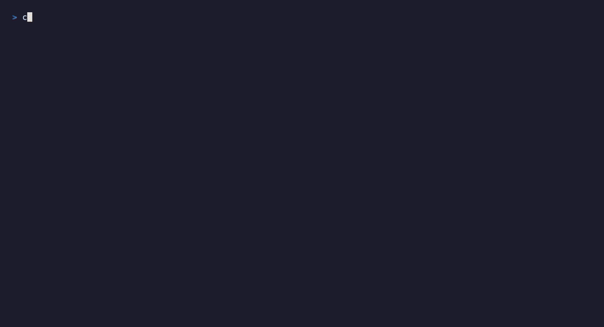

# ccradar

A terminal dashboard to find, switch to, and resume your **Claude Code** sessions
across **Ghostty**, **iTerm2**, and **Terminal.app** tabs.

If you run lots of Claude Code sessions in different tabs/projects, `ccradar` gives
you one screen to see them all, jump straight to the right native tab, and bring
old sessions back to life — no tmux, no fork. It reads Claude Code's own local
data and drives your terminal through its AppleScript API. No daemon, no network.



## Features

- **Works with Ghostty, iTerm2, and Terminal.app** — auto-detected from
  `$TERM_PROGRAM`. iTerm2/Terminal match sessions to tabs *exactly* by tty;
  Ghostty matches by directory + title (and upgrades to tty on versions newer
  than 1.3.1).
- **Active view** — every live session, grouped by directory. `enter` focuses its
  real tab (even when it's an inactive iTerm/Ghostty split pane next to logs/git).
- **Detached section** — live sessions with no open tab (closed tab / tmux / ssh)
  are shown separately with their pid; `x` cleans up a leftover.
- **Historical view** — past sessions reconstructed from transcripts. `enter` opens
  a new tab and runs `claude --resume <id>` in the original directory; `c` copies
  the command instead.
- **Notifications** — get a native macOS notification the moment a session leaves
  **busy** — either finishing (**idle**) or pausing for your input (**waiting**).
  Toggle with `n`; the choice is remembered.
- **Fuzzy search** (`/`) across directory + session title, and a **sort toggle**
  (`s`) between alphabetical and last-active.
- Each row shows the **model** in use; live auto-refresh, status/age at a glance,
  directory grouping.
- **Update check** — on launch ccradar checks GitHub for the latest release and,
  if newer, shows `⬆ vX.Y.Z` plus the right upgrade command for how you installed
  (`brew upgrade` vs `go install`). Best-effort and disableable with
  `CCRADAR_NO_UPDATE_CHECK=1`.

## Install

**Homebrew** (no Go needed):

```sh
brew install atarnvik/tap/ccradar
```

**Go:**

```sh
go install github.com/atarnvik/ccradar@latest
```

Then:

```sh
ccradar              # all sessions
ccradar ~/src/app    # only sessions in that directory and its subdirectories
ccradar --version    # print the installed version
```

Or build from source:

```sh
git clone https://github.com/atarnvik/ccradar.git
cd ccradar
go build -o ccradar . && ./ccradar
```

## Requirements

- **macOS** with a supported terminal: **[Ghostty](https://ghostty.org)** (tested
  on 1.3.1), **iTerm2**, or **Terminal.app**. The terminal is auto-detected from
  `$TERM_PROGRAM`; override with `CCRADAR_TERM=ghostty|iterm|terminal`.
- **[Claude Code](https://claude.com/claude-code)** CLI (`claude`) for resume.
- **Go** 1.24+ to install/build.
- First run triggers a one-time macOS **Automation** permission prompt — allow
  your terminal to control the terminal app. The first notification may likewise prompt to
  allow notifications.
- [`terminal-notifier`](https://github.com/julienXX/terminal-notifier) for
  reliable notification banners — **installed automatically with the Homebrew
  cask**. If you installed via `go install`, add it with
  `brew install terminal-notifier`. Without it, ccradar falls back to `osascript`,
  whose notifications appear as **Script Editor**; if those only land silently in
  Notification Center, set Script Editor to **Banners/Alerts** and **Deliver
  Prominently** in *System Settings → Notifications*.

## Keys

| Key | Action |
| --- | --- |
| `↑`/`↓` or `j`/`k` | move |
| `tab` (or `1`/`2`) | switch Active / Historical |
| `enter` | Active: focus tab · Historical: resume in a new tab |
| `/` | fuzzy search (directory + title); `enter` keep, `esc` clear |
| `s` | toggle sort: alphabetical ↔ last-active |
| `n` | toggle busy→idle notifications (remembered across runs) |
| `c` | Historical: copy `cd <dir> && claude --resume <id>` to clipboard |
| `x` | Active: kill a detached (no-tab) session (press twice to confirm) |
| `r` | refresh · `q` quit |

## How it works

| Source | Used for |
| --- | --- |
| `~/.claude/sessions/<pid>.json` | live registry: pid, cwd, status, heartbeat |
| `~/.claude/projects/*/<sid>.jsonl` | session title (`ai-title`) + model + history |
| `ps -o tty=` | the session process's controlling tty |
| `osascript` → your terminal | enumerate surfaces, focus / open tabs |

Each terminal has a small driver (`ghostty.go`, `iterm.go`, `terminal.go`) behind
a common interface. A session is paired to a surface **exactly by tty** on
iTerm2/Terminal.app (`ps` gives the pid's tty; the terminal reports each
tab/session's tty). On Ghostty 1.3.1, which doesn't expose a tty, it falls back
to **directory + title** — and upgrades to tty automatically on newer Ghostty.
`focus` brings the matched tab/pane to the front; resume opens a new tab (iTerm/
Ghostty) or window (Terminal.app) running `claude --resume`.

Sessions are classified by tab reachability: **open** (focusable), **detached**
(live but no tab), **historical** (no process). Heartbeat isn't used for liveness —
idle sessions stop heartbeating — so liveness is the live pid plus the tab match.

## Limitations

- macOS only (built on each terminal's AppleScript API).
- Terminal.app has no scriptable "new tab", so **resume opens a new window** there.
- Ghostty 1.3.1 matches by cwd + title (a brand-new session appears once it has a
  title, usually seconds); iTerm2/Terminal.app match instantly and exactly by tty.

## License

MIT — see [LICENSE](LICENSE).
